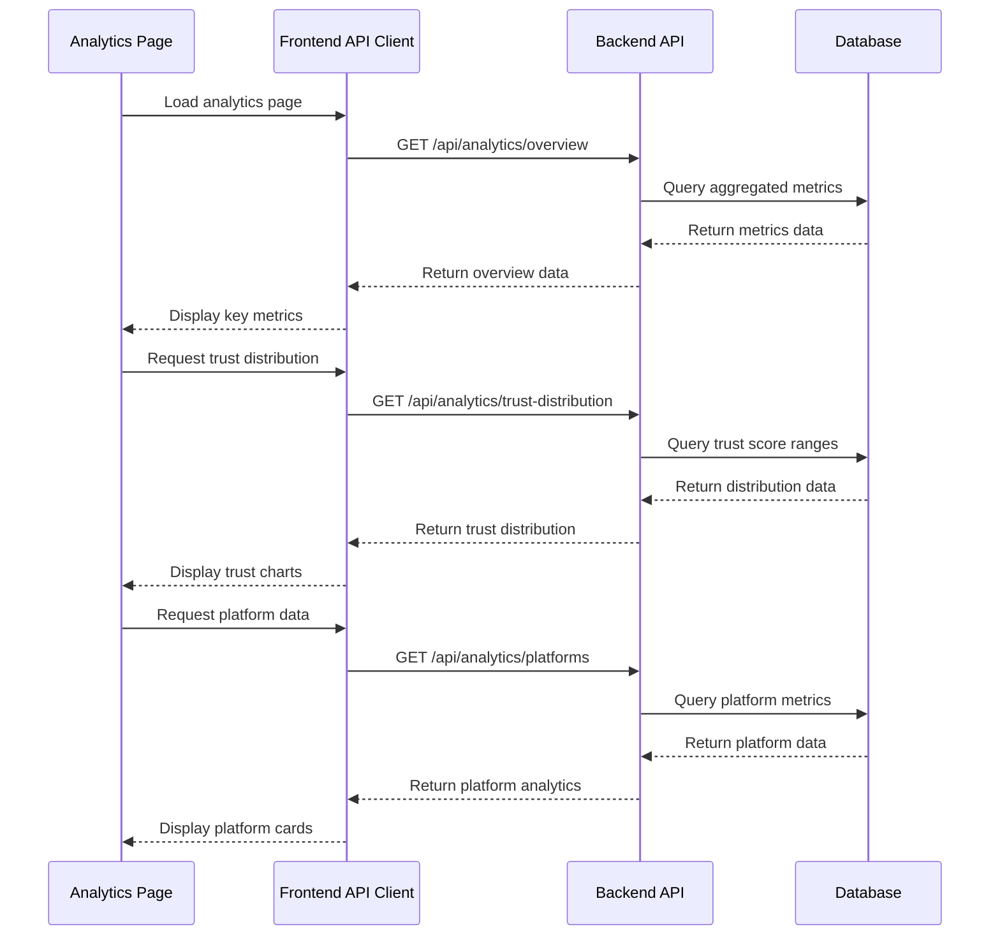

# Design Document: Dynamic Analytics Data

## Overview

Replace all hardcoded demo data in the analytics page with real-time data from backend APIs. The analytics page currently displays extensive hardcoded metrics including user counts, trust scores, platform coverage, threat intelligence, and scoring criteria. This design maintains the exact same UI/UX while transforming the data source from static constants to dynamic API calls.

## Main Algorithm/Workflow



## Core Interfaces/Types

```typescript
// Analytics Overview Response
interface AnalyticsOverview {
  totalUsers: number
  totalUsersGrowth: number
  trustScans: number
  trustScansGrowth: number
  threatsBlocked: number
  threatsBlockedSuccessRate: number
  avgTrustScore: number
  avgTrustScoreChange: number
  activeScans: number
  activeScansGrowth: number
  trustVerifications: number
  trustVerificationsGrowth: number
  riskAlerts: number
  riskAlertsChange: number
  protectedUsers: number
  protectedUsersGrowth: number
}

// Trust Score Distribution
interface TrustScoreRange {
  range: string
  count: number
  percentage: number
  color: string
}

interface TrustDistribution {
  ranges: TrustScoreRange[]
}

// Platform Coverage
interface PlatformCoverage {
  name: string
  scans: number
  coverage: number
  dotColor: string
}

// Platform Performance
interface PlatformPerformance {
  name: string
  protectedUsers: number
  avgPulseScore: number
  threatsBlocked: number
  growth: number
}

// Trust Ecosystem Metrics
interface TrustEcosystem {
  dataCollection: {
    metric: string
    description: string
  }
  analysisEngine: {
    metric: string
    description: string
  }
  trustScoring: {
    metric: string
    description: string
  }
  userProtection: {
    metric: string
    description: string
  }
}

// Scoring Criteria
interface ScoringCriterion {
  title: string
  weight: number
  maxPoints: number
  description: string
  exampleScore: number
  points: number
}

// Platform Analytics Summary
interface PlatformSummary {
  totalSellers: number
  avgScore: number
  highRisk: number
}

// API Response Wrapper
interface ApiResponse<T> {
  success: boolean
  data: T
  message?: string
}
```

## Key Functions with Formal Specifications

### Function 1: getAnalyticsOverview()

```typescript
function getAnalyticsOverview(): Promise<ApiResponse<AnalyticsOverview>>
```

**Preconditions:**
- User is authenticated
- User has valid JWT token
- Backend API is available

**Postconditions:**
- Returns valid AnalyticsOverview object
- All numeric fields are non-negative
- Growth percentages are valid numbers (can be negative)
- If error: returns error response with success=false

**Loop Invariants:** N/A

### Function 2: getTrustDistribution()

```typescript
function getTrustDistribution(): Promise<ApiResponse<TrustDistribution>>
```

**Preconditions:**
- User is authenticated
- Database contains seller trust score data

**Postconditions:**
- Returns array of 5 trust score ranges
- Sum of all percentages equals 100 (±0.1 for rounding)
- Each range has valid count ≥ 0
- Ranges are ordered from highest to lowest scores

**Loop Invariants:**
- For each range processed: total percentage ≤ 100

### Function 3: getPlatformCoverage()

```typescript
function getPlatformCoverage(): Promise<ApiResponse<PlatformCoverage[]>>
```

**Preconditions:**
- User is authenticated
- Platform data exists in database

**Postconditions:**
- Returns array of platform objects
- Each platform has scans ≥ 0
- Coverage percentage is between 0 and 100
- Platform names are non-empty strings

**Loop Invariants:** N/A

### Function 4: getPlatformPerformance()

```typescript
function getPlatformPerformance(): Promise<ApiResponse<PlatformPerformance[]>>
```

**Preconditions:**
- User is authenticated
- Platform performance metrics exist

**Postconditions:**
- Returns array of platform performance data
- protectedUsers ≥ 0
- avgPulseScore is between 0 and 100
- threatsBlocked ≥ 0
- growth is a valid number (can be negative)

**Loop Invariants:** N/A

### Function 5: getScoringCriteria()

```typescript
function getScoringCriteria(): Promise<ApiResponse<ScoringCriterion[]>>
```

**Preconditions:**
- User is authenticated

**Postconditions:**
- Returns array of 4 scoring criteria
- Sum of all weights equals 100
- Each criterion has maxPoints > 0
- exampleScore is between 0 and 100
- points ≤ maxPoints for each criterion

**Loop Invariants:**
- For each criterion processed: total weight ≤ 100

### Function 6: getPlatformSummary()

```typescript
function getPlatformSummary(): Promise<ApiResponse<PlatformSummary>>
```

**Preconditions:**
- User is authenticated
- Seller data exists in database

**Postconditions:**
- totalSellers ≥ 0
- avgScore is between 0 and 100
- highRisk ≥ 0 and ≤ totalSellers

**Loop Invariants:** N/A

### Function 7: getTrustEcosystem()

```typescript
function getTrustEcosystem(): Promise<ApiResponse<TrustEcosystem>>
```

**Preconditions:**
- User is authenticated
- System metrics are available

**Postconditions:**
- Returns valid TrustEcosystem object
- All metric strings are non-empty
- All description strings are non-empty

**Loop Invariants:** N/A

## Algorithmic Pseudocode

### Main Analytics Data Loading Algorithm

```pascal
ALGORITHM loadAnalyticsData(activeTab)
INPUT: activeTab of type string
OUTPUT: void (updates UI state)

BEGIN
  ASSERT activeTab IN ["overview", "trust-ecosystem", "scoring-model", "platforms", "security", "advanced"]
  
  // Step 1: Set loading state
  setIsLoading(true)
  setError(null)
  
  // Step 2: Load data based on active tab
  IF activeTab = "overview" THEN
    SEQUENCE
      overviewData ← AWAIT getAnalyticsOverview()
      trustDistData ← AWAIT getTrustDistribution()
      platformCovData ← AWAIT getPlatformCoverage()
      platformSummary ← AWAIT getPlatformSummary()
      
      IF overviewData.success AND trustDistData.success THEN
        updateUIState(overviewData.data, trustDistData.data, platformCovData.data, platformSummary.data)
      ELSE
        setError("Failed to load analytics data")
      END IF
    END SEQUENCE
    
  ELSE IF activeTab = "trust-ecosystem" THEN
    SEQUENCE
      ecosystemData ← AWAIT getTrustEcosystem()
      platformPerfData ← AWAIT getPlatformPerformance()
      trustDistData ← AWAIT getTrustDistribution()
      
      IF ecosystemData.success AND platformPerfData.success THEN
        updateUIState(ecosystemData.data, platformPerfData.data, trustDistData.data)
      ELSE
        setError("Failed to load ecosystem data")
      END IF
    END SEQUENCE
    
  ELSE IF activeTab = "scoring-model" THEN
    SEQUENCE
      scoringData ← AWAIT getScoringCriteria()
      
      IF scoringData.success THEN
        updateUIState(scoringData.data)
      ELSE
        setError("Failed to load scoring criteria")
      END IF
    END SEQUENCE
    
  ELSE IF activeTab = "platforms" THEN
    SEQUENCE
      platformPerfData ← AWAIT getPlatformPerformance()
      
      IF platformPerfData.success THEN
        updateUIState(platformPerfData.data)
      ELSE
        setError("Failed to load platform data")
      END IF
    END SEQUENCE
  END IF
  
  // Step 3: Clear loading state
  setIsLoading(false)
  
  ASSERT isLoading = false
END
```

### Backend Data Aggregation Algorithm

```pascal
ALGORITHM aggregateAnalyticsOverview()
INPUT: none (uses database)
OUTPUT: AnalyticsOverview

BEGIN
  // Step 1: Query current metrics
  totalUsers ← COUNT(SELECT * FROM users WHERE role = 'user')
  totalScans ← COUNT(SELECT * FROM seller_extractions)
  threatsBlocked ← COUNT(SELECT * FROM sellers WHERE riskScore >= 70)
  avgScore ← AVG(SELECT pulseScore FROM sellers)
  
  // Step 2: Query historical metrics for growth calculation
  previousUsers ← COUNT(SELECT * FROM users WHERE role = 'user' AND createdAt < NOW() - INTERVAL '30 days')
  previousScans ← COUNT(SELECT * FROM seller_extractions WHERE createdAt < NOW() - INTERVAL '7 days')
  
  // Step 3: Calculate growth percentages
  IF previousUsers > 0 THEN
    usersGrowth ← ((totalUsers - previousUsers) / previousUsers) * 100
  ELSE
    usersGrowth ← 0
  END IF
  
  IF previousScans > 0 THEN
    scansGrowth ← ((totalScans - previousScans) / previousScans) * 100
  ELSE
    scansGrowth ← 0
  END IF
  
  // Step 4: Build response object
  overview ← {
    totalUsers: totalUsers,
    totalUsersGrowth: ROUND(usersGrowth, 1),
    trustScans: totalScans,
    trustScansGrowth: ROUND(scansGrowth, 1),
    threatsBlocked: threatsBlocked,
    avgTrustScore: ROUND(avgScore, 1),
    // ... other fields
  }
  
  ASSERT overview.totalUsers >= 0
  ASSERT overview.trustScans >= 0
  
  RETURN overview
END
```

### Trust Distribution Calculation Algorithm

```pascal
ALGORITHM calculateTrustDistribution()
INPUT: none (uses database)
OUTPUT: TrustDistribution

BEGIN
  // Step 1: Query all seller scores
  sellers ← SELECT pulseScore FROM sellers WHERE pulseScore IS NOT NULL
  totalSellers ← COUNT(sellers)
  
  ASSERT totalSellers >= 0
  
  // Step 2: Initialize ranges
  ranges ← [
    {range: "90-100", count: 0, percentage: 0, color: "bg-green-500"},
    {range: "80-89", count: 0, percentage: 0, color: "bg-blue-500"},
    {range: "70-79", count: 0, percentage: 0, color: "bg-gray-400"},
    {range: "60-69", count: 0, percentage: 0, color: "bg-orange-500"},
    {range: "Below 60", count: 0, percentage: 0, color: "bg-amber-700"}
  ]
  
  // Step 3: Count sellers in each range
  FOR each seller IN sellers DO
    score ← seller.pulseScore
    
    IF score >= 90 AND score <= 100 THEN
      ranges[0].count ← ranges[0].count + 1
    ELSE IF score >= 80 AND score < 90 THEN
      ranges[1].count ← ranges[1].count + 1
    ELSE IF score >= 70 AND score < 80 THEN
      ranges[2].count ← ranges[2].count + 1
    ELSE IF score >= 60 AND score < 70 THEN
      ranges[3].count ← ranges[3].count + 1
    ELSE IF score < 60 THEN
      ranges[4].count ← ranges[4].count + 1
    END IF
  END FOR
  
  // Step 4: Calculate percentages
  IF totalSellers > 0 THEN
    FOR each range IN ranges DO
      range.percentage ← ROUND((range.count / totalSellers) * 100, 1)
    END FOR
  END IF
  
  ASSERT SUM(ranges[i].percentage for all i) <= 100.1 AND >= 99.9
  
  RETURN {ranges: ranges}
END
```

## Example Usage

```typescript
// Frontend: Analytics Page Component
import { useEffect, useState } from 'react'
import { analyticsAPI } from '@/lib/api/client'

function AnalyticsContent() {
  const [overview, setOverview] = useState<AnalyticsOverview | null>(null)
  const [trustDist, setTrustDist] = useState<TrustDistribution | null>(null)
  const [isLoading, setIsLoading] = useState(true)
  const [error, setError] = useState<string | null>(null)

  useEffect(() => {
    const loadData = async () => {
      setIsLoading(true)
      setError(null)
      
      try {
        // Load overview data
        const overviewRes = await analyticsAPI.getOverview()
        if (overviewRes.success) {
          setOverview(overviewRes.data)
        }
        
        // Load trust distribution
        const trustRes = await analyticsAPI.getTrustDistribution()
        if (trustRes.success) {
          setTrustDist(trustRes.data)
        }
      } catch (err: any) {
        setError(err.message || 'Failed to load analytics')
      } finally {
        setIsLoading(false)
      }
    }
    
    loadData()
  }, [])

  if (isLoading) return <LoadingSpinner />
  if (error) return <ErrorMessage message={error} />

  return (
    <div>
      {/* Display overview metrics */}
      <MetricCard 
        title="Total Users" 
        value={overview?.totalUsers} 
        growth={overview?.totalUsersGrowth} 
      />
      
      {/* Display trust distribution */}
      <TrustChart data={trustDist?.ranges} />
    </div>
  )
}

// Backend: Analytics Controller
export async function getAnalyticsOverview(req: Request, res: Response) {
  try {
    // Validate user authentication
    if (!req.user) {
      return res.status(401).json({
        success: false,
        message: 'Unauthorized'
      })
    }
    
    // Aggregate metrics from database
    const totalUsers = await User.count({ where: { role: 'user' } })
    const totalScans = await SellerExtraction.count()
    const avgScore = await Seller.aggregate('pulseScore', 'avg')
    
    // Calculate growth metrics
    const previousUsers = await User.count({
      where: {
        role: 'user',
        createdAt: { [Op.lt]: new Date(Date.now() - 30 * 24 * 60 * 60 * 1000) }
      }
    })
    
    const usersGrowth = previousUsers > 0 
      ? ((totalUsers - previousUsers) / previousUsers) * 100 
      : 0
    
    // Build response
    const overview: AnalyticsOverview = {
      totalUsers,
      totalUsersGrowth: Math.round(usersGrowth * 10) / 10,
      trustScans: totalScans,
      avgTrustScore: Math.round(avgScore * 10) / 10,
      // ... other fields
    }
    
    return res.json({
      success: true,
      data: overview
    })
  } catch (error) {
    console.error('Error fetching analytics overview:', error)
    return res.status(500).json({
      success: false,
      message: 'Failed to fetch analytics overview'
    })
  }
}
```

## Correctness Properties

*A property is a characteristic or behavior that should hold true across all valid executions of a system—essentially, a formal statement about what the system should do. Properties serve as the bridge between human-readable specifications and machine-verifiable correctness guarantees.*

### Property 1: All Numeric Metrics Are Non-Negative

*For any* analytics response (overview, platform coverage, platform performance, or platform summary), all numeric count and metric fields should be non-negative (≥ 0).

**Validates: Requirements 1.2, 3.2, 4.2, 4.4, 6.2, 6.5**

### Property 2: Score Values Within Valid Range

*For any* analytics response containing score values (avgTrustScore, avgPulseScore, avgScore), the score should be between 0 and 100 inclusive.

**Validates: Requirements 4.3, 6.3**

### Property 3: Trust Distribution Percentages Sum to 100

*For any* trust distribution calculation, the sum of all range percentages should equal 100 within a tolerance of ±0.1 for rounding.

**Validates: Requirements 2.3**

### Property 4: Trust Distribution Categorization

*For any* seller pulse score, the score should be categorized into exactly one of five ranges: 90-100, 80-89, 70-79, 60-69, or below 60.

**Validates: Requirements 2.2**

### Property 5: Platform Coverage Percentage Bounds

*For any* platform in the coverage response, the coverage percentage should be between 0 and 100 inclusive.

**Validates: Requirements 3.3**

### Property 6: Scoring Criteria Weights Sum to 100

*For any* scoring criteria response, the sum of all criterion weights should equal exactly 100.

**Validates: Requirements 5.2**

### Property 7: Points Never Exceed Maximum

*For any* scoring criterion, the points value should not exceed the maxPoints value.

**Validates: Requirements 5.4**

### Property 8: High Risk Count Bounded by Total

*For any* platform summary, the high-risk seller count should not exceed the total seller count and should be non-negative.

**Validates: Requirements 6.4**

### Property 9: API Response Structure Consistency

*For any* API response, if success is true then data should not be null, and if success is false then message should not be null.

**Validates: Requirements 12.1, 12.2, 12.3, 12.4**

### Property 10: Growth Calculation Formula

*For any* growth metric calculation with non-zero previous value, the growth percentage should equal ((current - previous) / previous) * 100 rounded to one decimal place.

**Validates: Requirements 11.4, 11.5**

### Property 11: Zero Previous Period Handling

*For any* growth calculation where the previous period count is zero, the growth value should be set to zero to avoid division by zero.

**Validates: Requirements 11.3**

### Property 12: Authentication Enforcement

*For any* analytics API endpoint request without a valid JWT token, the Backend_API should return a 401 Unauthorized response and not execute database queries.

**Validates: Requirements 8.1, 8.2, 8.4**

### Property 13: Error Response Structure

*For any* database query failure or error condition, the Backend_API should return a response with success set to false and include a descriptive error message.

**Validates: Requirements 9.1**

### Property 14: Tab-Based Data Loading

*For any* active tab selection, the Frontend_Client should request only the data endpoints required for that specific tab (overview, trust-ecosystem, scoring-model, or platforms).

**Validates: Requirements 10.1, 10.2, 10.3, 10.4, 10.5**

### Property 15: Required Response Fields Completeness

*For any* analytics response type, all required fields specified in the interface should be present and non-empty (for strings) or defined (for numbers).

**Validates: Requirements 1.4, 2.5, 3.4, 4.1, 5.5, 6.1, 7.2, 7.3**
